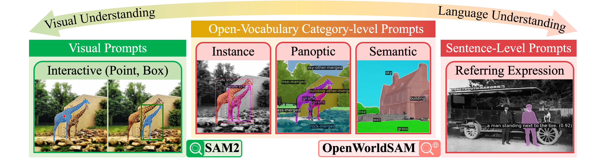

<div align="center">

# OpenWorldSAM: Extending SAM2 for Universal Image Segmentation with Language Prompts [NeurIPS 2025]

🎉 NeurIPS 2025 Spotlight 🎉 

[Shiting (Ginny) Xiao](https://scholar.google.com/citations?user=_KHyWmAAAAAJ&hl=en), [Rishabh Kabra](https://scholar.google.com/citations?user=NVD-BU4AAAAJ&hl=en), [Yuhang Li](https://scholar.google.com/citations?user=3UzXL-AAAAAJ&hl=zh-CN), [Donghyun Lee](https://scholar.google.com/citations?user=3-6c0TkAAAAJ&hl=zh-CN), [João Carreira](https://scholar.google.com/citations?user=IUZ-7_cAAAAJ&hl=en), [Priya Panda](https://scholar.google.com/citations?user=qA5WsYUAAAAJ&hl=en)

</div>

OpenWorldSAM pushes the boundaries of SAM2 by enabling **open-vocabulary segmentation** with flexible language prompts.
- 🚀 **No fine-tuning of SAM2 weights.**
- 🔧 **Unified pipeline for panoptic, instance, semantic, and referring expression segmentation guided by language prompts.**
- 📈 **State-of-the-art ZERO-SHOT performance across multiple benchmarks.**
- 💡 **Minimal overhead: just 4.5 M additional trainable parameters!**

📄 **[Read our paper on arXiv](https://arxiv.org/abs/2507.05427)**



## 📢 News

- **[2025-11-8]**: Launch the project page.

## ⚙️ Environment Setup

The code has been tested with **Python 3.10** and **PyTorch 2.5.1 (with CUDA 12.1)**. The commands below assume Linux with an NVIDIA GPU.

1. Create and activate the environment:
   ```bash
   conda create -n openworldsam python=3.10 -y
   conda activate openworldsam
   ```

2. Install PyTorch 2.5.1 with CUDA 12.1 (torch >= 2.0 is required for SAM2):
   ```bash
   conda install pytorch torchvision torchaudio pytorch-cuda=12.1 -c pytorch -c nvidia
   ```

3. Install core dependencies:
   ```bash
   pip install -r requirements.txt
   ```

4. Build the SAM2 extensions:
   ```bash
   cd model/segment_anything_2
   python setup.py build_ext --inplace
   ```
   
5. Install Detectron2 (custom build matching the paper's experiments):
   ```bash
   pip install --extra-index-url https://miropsota.github.io/torch_packages_builder detectron2==0.6+2a420edpt2.5.0cu121
   ```

## 📊 Data Preparation

Before running OpenWorldSAM, set up your `dataset`. The full dataset setup guide now lives in [DATASETS.md](./DATASETS.md). It covers COCO & RefCOCOg (for **training**), ADE20K (150 & 847), PASCAL-Context (59 & 459), VOC 2012, ScanNet, and SUN RGB-D (for **evaluation**), including download links and preprocessing commands. 

### Environment Variables

Set your dataset root directory via `DETECTRON2_DATASETS` before training or evaluation:

```bash
export DETECTRON2_DATASETS=/path/to/datasets
```

## 🚀 Pretrained Models

**Reproducing Our Results**: Below, we provide the `model weights` to replicate the results of our paper.

| Dataset               | Total Parameters | Trainable Params | mIoU     | Model                                                        |
| --------------------- | ---------------- | ---------------- | -------- | ------------------------------------------------------------ |
| **ADE20K-150**        | 902 M          | 4.5 M            | **60.4** | [Weights](https://drive.google.com/file/d/1z2HEGAFqDZa7vuoqAl0FS6YiJsEOD-Ds/view?usp=sharing) |
| **ADE20K-857**        | 902 M       | 4.5 M            | **33.1** | 👆🏻 |
| **PASCAL VOC 2012**   | 902 M       | 4.5 M            | **98.0** | 👆🏻 |
| **PASCAL Context-59** | 902 M       | 4.5 M            | **73.7** | 👆🏻 |
| **PASCAL Context-459** | 902 M       | 4.5 M            | **47.5** | 👆🏻 |
| **SUN-RGBD-37** | 902 M | 4.5 M | **67.7** | 👆🏻 |
| **ScanNet-40** | 902 M | 4.5 M | **55.6** | 👆🏻 |
| **RefCOCOg (UMD split)** | 902 M | 4.5 M | **74.0** | [Weights](https://drive.google.com/file/d/1yK6Yf5O5bAkCkuttwN4eZAu5RF_rAQ0z/view?usp=sharing) |

See [Evaluation](#evaluation) guidance.

## ▶️ Training and Evaluation

All experiments use Detectron2's training loop with YAML configs stored in `configs/`. Set `MODEL.WEIGHTS` to the path of the checkpoint you wish to resume from or leave blank for training from scratch.

Download pretrained backbones:

```bash
mkdir checkpoints
cd checkpoints

# Download BEiT-3 ViT-B checkpoint
wget -O beit3_large_patch16_224.pth https://github.com/addf400/files/releases/download/beit3/beit3_large_patch16_224.pth
# Download SAM2-large checkpoint
wget -O sam2_hiera_large.pt https://dl.fbaipublicfiles.com/segment_anything_2/072824/sam2_hiera_large.pt
```

### Training

On COCO-panoptic:

```bash
python train_net.py \
  --config-file configs/coco/panoptic-segmentation/Open-World-SAM2-CrossAttention.yaml \
  --num-gpus 4 \
  --run 0 \
  -b 8 \
  MODEL.WEIGHTS ""
```

On RefCOCOg:

```bash
python train_net.py \
  --config-file configs/refcoco/Open-World-SAM2-CrossAttention.yaml \
  --num-gpus 1 \
  --run 1 \
  -b 8 \
  MODEL.WEIGHTS ""
```

Adjust `--num-gpus`, batch size (`-b` or `SOLVER.IMS_PER_BATCH`), and output directory as needed.

### Evaluation

Set `MODEL.WEIGHTS` within the config or via command-line overrides to evaluate specific checkpoints. Run the following command to evaluate on any dataset:

```bash
python train_net.py --config-file configs/DATASET/config.yaml --eval-only MODEL.WEIGHTS path/to/weights
```

Specific datasets:

- **ADE20K-150 panoptic & semantic**
  
  ```bash
  python train_net.py --config-file configs/ade20k/panoptic-segmentation/Open-World-SAM2-CrossAttention.yaml --eval-only
  ```
- **ADE20K-150 instance**
  ```bash
  python train_net.py --config-file configs/ade20k/instance-segmentation/Open-World-SAM2-CrossAttention.yaml --eval-only
  ```
- **ADE20K-847 semantic**
  
  ```bash
  python train_net.py --config-file configs/ade20k/semantic-segmentation/Open-World-SAM2-CrossAttention.yaml --eval-only
  ```

- **PASCAL VOC & Context semantic**

  ```bash
  python train_net.py --config-file configs/pascal/semantic-segmentation/Open-World-SAM2-CrossAttention.yaml --eval-only
  ```
   Change `DATASETS.TEST` for different evaluation sets: `pascal_context_459_sem_seg_val`, `pascal_context_59_sem_seg_val`, and `pascalvoc20_sem_seg_val`.

- **SUN-RGBD semantic**

  ```bash
  python train_net.py --config-file configs/sun-rgbd/semantic-segmentation/Open-World-SAM2-CrossAttention.yaml --eval-only
  ```

- **ScanNet panoptic**
  
  ```bash
  python train_net.py --config-file configs/scannet/panoptic-segmentation/Open-World-SAM2-CrossAttention.yaml --eval-only
  ```

- **RefCOCOg referring expression**

  ```bash
  python train_net.py --config-file configs/refcoco/Open-World-SAM2-CrossAttention.yaml --eval-only
  ```


## Project Structure

- `configs/`: Detectron2 YAML configs for all datasets and tasks.
- `datasets/`: Data preparation scripts referenced above.
- `evaluation/`: Evaluation utilities including language-guided metrics.
- `model/`: OpenWorldSAM model components and SAM2 extensions.
- `train_net.py`: Entry point for training and evaluation.

## 🔗 Acknowledgements

We build upon the amazing work from:

- [Segment Anything 2](https://github.com/facebookresearch/sam2)
- [EVF-SAM](https://github.com/hustvl/EVF-SAM)
- [X-Decoder](https://github.com/microsoft/X-Decoder/tree/main)

## Citation

If you find OpenWorldSAM useful in your research, please cite our paper:

```bibtex
@inproceedings{openworldsam2025,
  title     = {OpenWorldSAM: Extending SAM2 for Universal Image Segmentation with Language Prompts},
  author={Xiao, Shiting and Kabra, Rishabh and Li, Yuhang and Lee, Donghyun and Carreira, Joao and Panda, Priyadarshini},
  booktitle = {Advances in Neural Information Processing Systems (NeurIPS)},
  year      = {2025},
}
```
